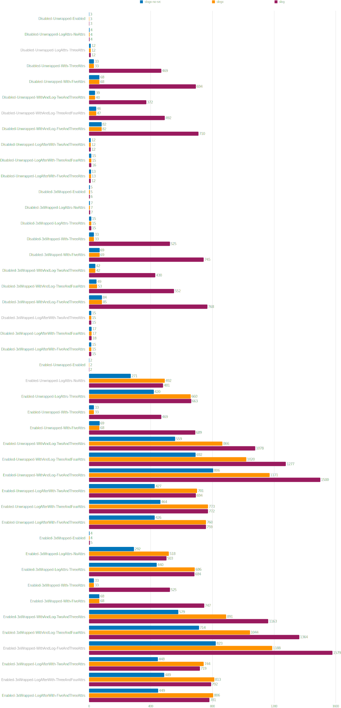
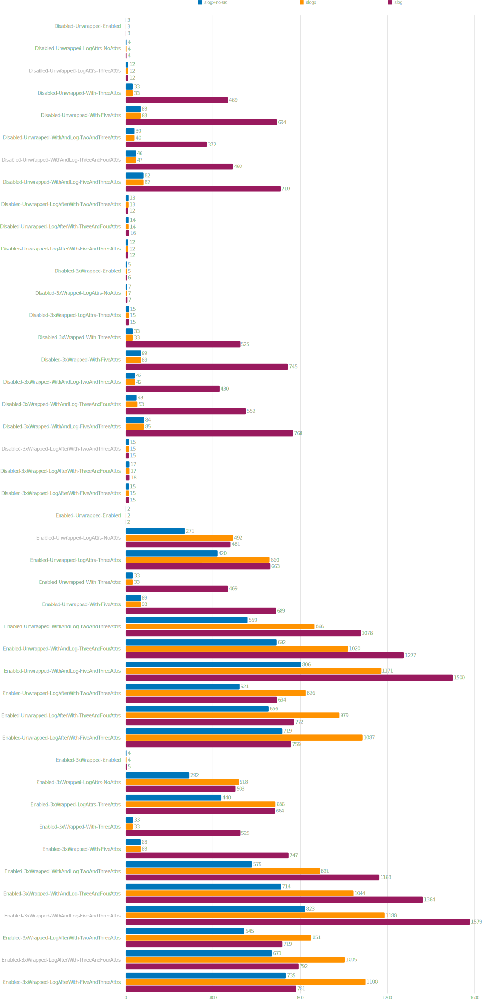
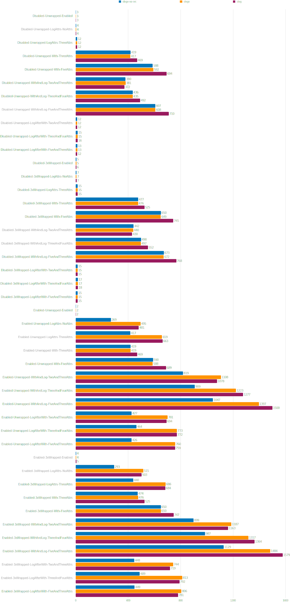
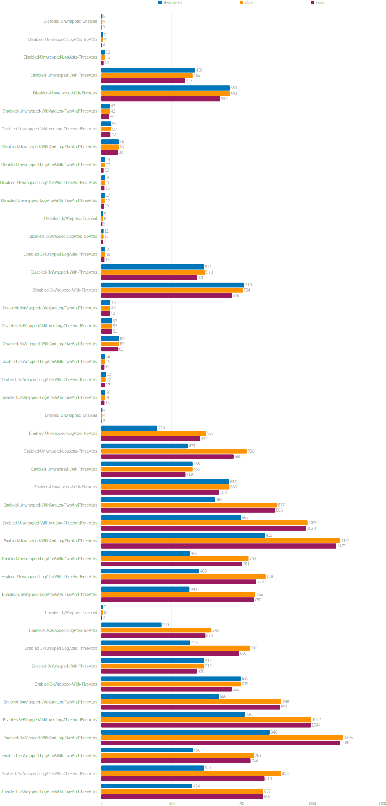

# Benchmark Results

## Benchmarks of slogx.Logger using optimal selection of Logger.With or Logger.WithLongTerm method calls

Performance of [slogx.Logger](https://pkg.go.dev/github.com/pamburus/slogx#Logger) compared to [slog.Logger](https://pkg.go.dev/log/slog#Logger) with [slog.JSONHandler](https://pkg.go.dev/log/slog#JSONHandler) as a backend.
Logger's [WithLongTerm](https://pkg.go.dev/github.com/pamburus/slogx#Logger.WithLongTerm) method is used in all LogAfterWith tests, as it is an optimal strategy for this use case.
Values are in nanoseconds per operation.

## Benchmarks of slogx.Logger using only Logger.With method calls

Performance of [slogx.Logger](https://pkg.go.dev/github.com/pamburus/slogx#Logger) compared to [slog.Logger](https://pkg.go.dev/log/slog#Logger) with [slog.JSONHandler](https://pkg.go.dev/log/slog#JSONHandler) as a backend.
Logger's [WithLongTerm](https://pkg.go.dev/github.com/pamburus/slogx#Logger.WithLongTerm) method is never used in these tests, so LogAfterWith tests have significant performance degradation.
But at the same time in many other cases especially when the handler is disabled performance is significantly improved. For optimal performance use [WithLongTerm](https://pkg.go.dev/github.com/pamburus/slogx#Logger.WithLongTerm) when the resulting logger is planned to be used more than 3-4 times.
Values are in nanoseconds per operation.

## Benchmarks of slogx.Logger using only Logger.WithLongTerm method calls

Performance of [slogx.Logger](https://pkg.go.dev/github.com/pamburus/slogx#Logger) compared to [slog.Logger](https://pkg.go.dev/log/slog#Logger) with [slog.JSONHandler](https://pkg.go.dev/log/slog#JSONHandler) as a backend.
Logger's [WithLongTerm](https://pkg.go.dev/github.com/pamburus/slogx#Logger.WithLongTerm) method is always used in these tests, so LogAfterWith tests do not have significant performance degradation.
But at the same time there is no significant performance improvements in other use cases as well. For optimal performance use [WithLongTerm](https://pkg.go.dev/github.com/pamburus/slogx#Logger.WithLongTerm) when the resulting logger is planned to be used more than 3-4 times.
Values are in nanoseconds per operation.

## Benchmarks of usage context.Context with slogc package instead of slogx.Logger

Performance comparison of [slogc](https://pkg.go.dev/github.com/pamburus/slogx/slogc) usage against [slogx.Logger](https://pkg.go.dev/github.com/pamburus/slogx#Logger) with optimal usage of [WithLongTerm](https://pkg.go.dev/github.com/pamburus/slogx#Logger.WithLongTerm) calls.
Values are in nanoseconds per operation.

